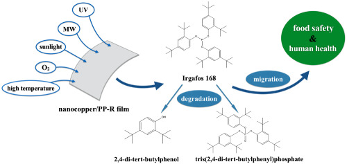
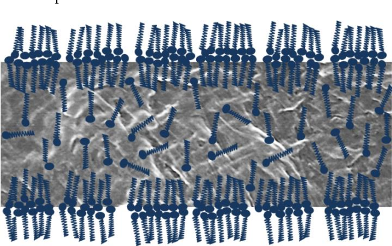

In plastic materials used in most products the basic polymer is incorporated into a formulary (plastic compound) with different ‘additives’, which are chemical compounds added to improve the performance (e.g. during shaping of the polymer, through injection molding, extrusion, blow molding, vacuum molding, etc.), functionality and ageing properties of the polymer. The most commonly used additives in different types of polymeric packaging materials are: plasticizers, flame retardants, antioxidants, acid scavengers, light and heat stabilizers, lubricants, pigments, antistatic agents, slip compounds and thermal stabilizers. Each of them plays a distinct role in delivering/enhancing the (final) functional properties of a plastic product.

let's have a more precise look on some of these families:

# Antioxidants

Antioxidants are embedded in various polymer resins to delay the overall oxidative degradation of plastics if/when exposed to ultraviolet (UV) light. The highly reactive free radicals that are generated by heat, radiation, and mechanical shear (often exacerbated by the presence of metallic impurities), cause the polymer to degrade. In food packaging, the potential for oxidation increases in the case of exposure to high temperatures, including contact with hot foods, exposure to infrared heating, retort processing and microwave (MW) heating.

Arylamines are the most commonly used antioxidants in plastic food packaging. Phenolics and organophosphites (used to reduce hydroperoxides formed during oxidation to alcohols) are also used as antioxidants. The first group includes BHT, BHA, **Irganox 1010**, BPA and Cyanox 2246 and 425, while the latter group includes TNPP and **Irgafos 168**.

# Slip agents

Slip compounds are responsible for significantly reducing the surface coefficient of friction of a polymer. In addition to providing lubrication to the film surface, they are also used to enhance the polymer with antistatic properties, enable better mould release, reduced melt viscosity, and anti-sticking properties. Some of the most commonly used slip compounds are fatty acid amides (primary **erucamide** and **oleamide**), fatty acid esters, metallic stearates (**Calcium stearate**, **Zinc stearate**), and waxes

> A Schematic representation of the double bilayer formation by erucamide in SEM micrograph of HDPE

We in M&J Trading do have capabilities to supply complete line of chemical for PE/PP/PVC manufacturers with the best delivery and price conditions.
